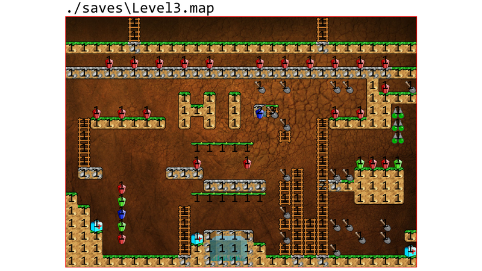
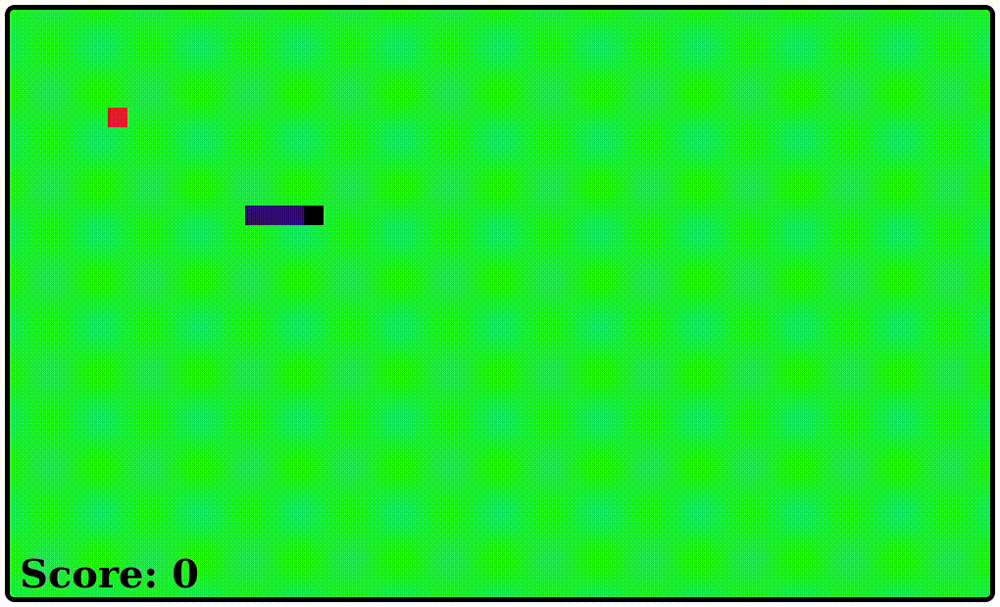
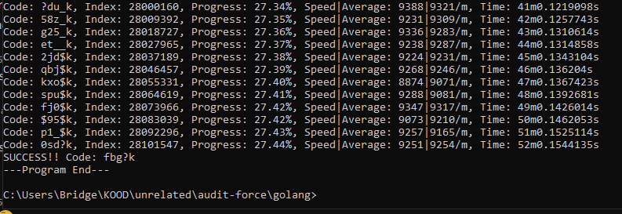

# [Real Time Forum](https://github.com/MM1132/real-time-forum)

-   Deployable and customizable forum with lots of features

# [Amazing Level Editor](https://github.com/MM1132/amazing-level-editor)

-   An advanced tile-based level editor made with Python's `PyGame` library.
-   Create your own maps from custom tilesets.

# [CanvasLess2d](https://github.com/MM1132/canvasless2d)

-   HTML particle graphics engine that doesn't use `<canvas>` element.
-   `Pure HTML` takes full advantage of CSS to style and animate the particles.

# [PyMahjong](https://github.com/MM1132/PyMahjong)

-   A very intense mahjong game developed with Python's `PyGame` library.

# [Nastik](https://github.com/MM1132/nastik/)

-   A simple and boring 2d snake game coded in plain `JavaScript`.

# [Audit Force](https://github.com/MM1132/Audit-Force)

-   A powerful brute-force tool that exploits the 01 Edu System platform.

